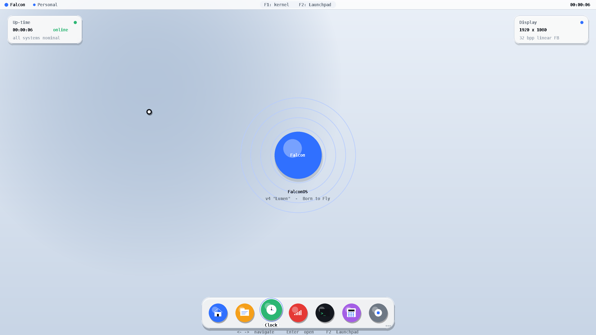
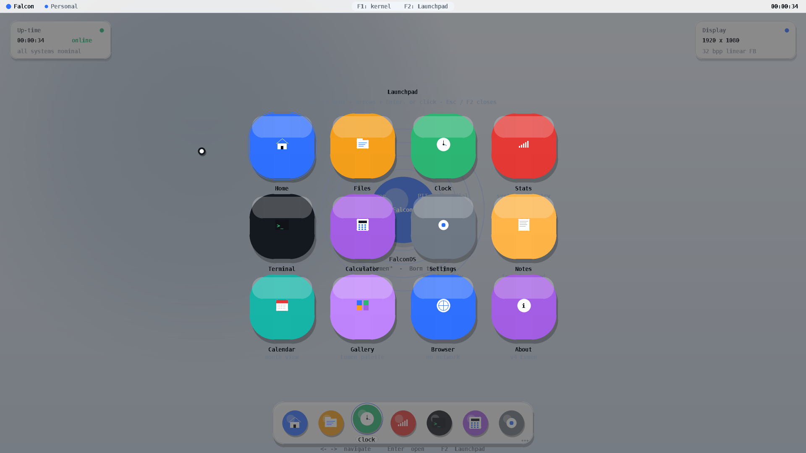
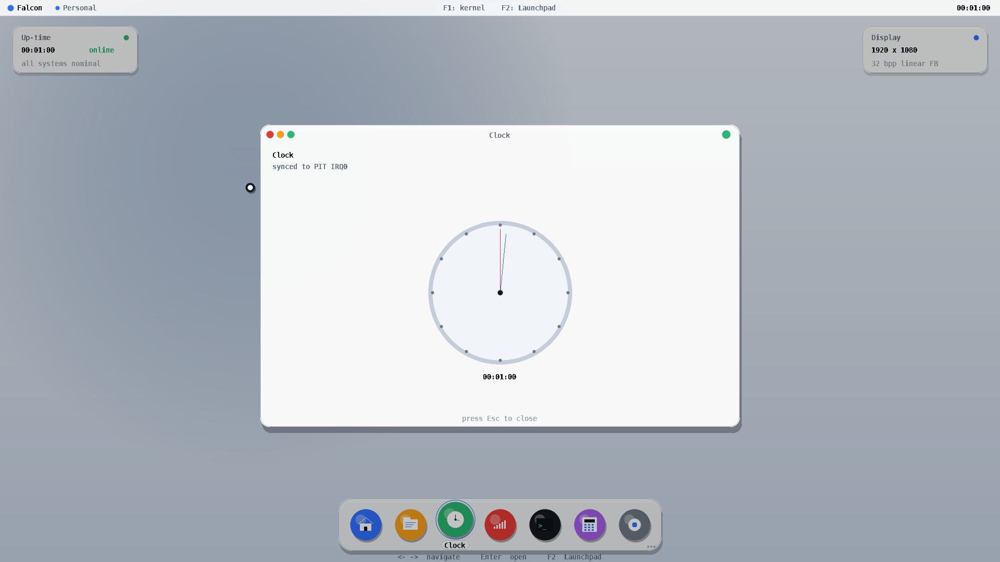
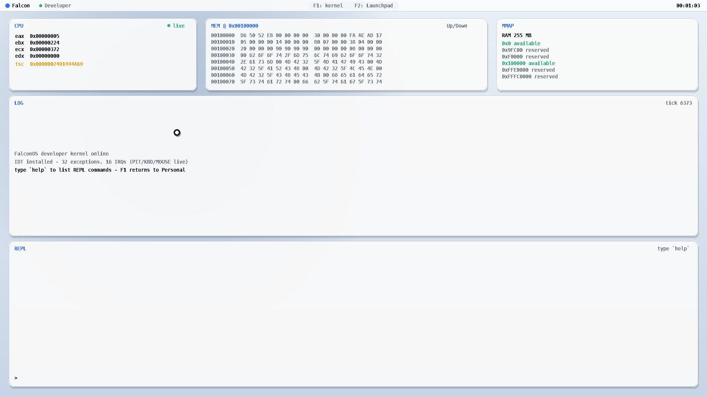
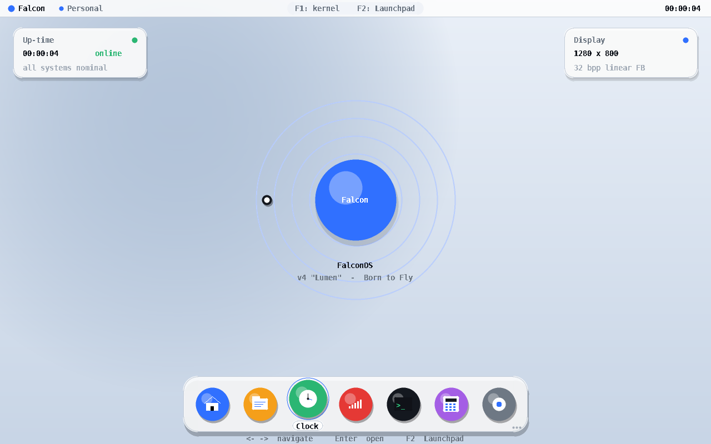
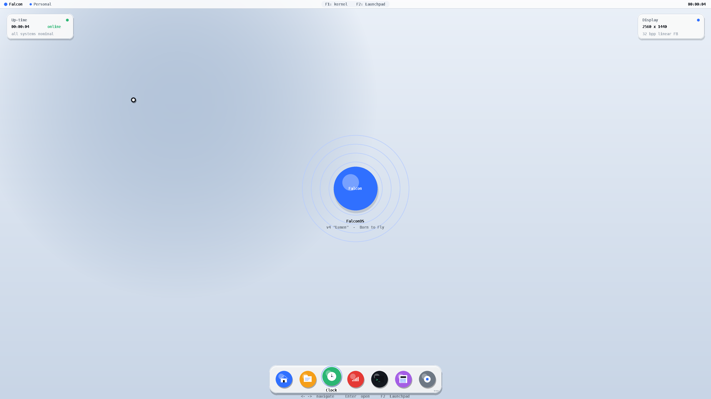

# FalconOS

> A bare-metal x86 operating system with **two kernels in one**: switch
> between a macOS-styled *Personal Kernel* and a hacker-grade *Developer
> Kernel* live, with a single key-press.

```
      ___---___
    //  (   )  \\         F a l c o n O S
   /  (  ~~~  )  \
  |  / O\   /O \  |       v4.0  · LUMEN EDITION
  |  |   \ /   |  |
   \ |  _/~~~\_  | /
    \|_/       \_|/        << Born  to  Fly >>
         |   |
        /|   |\
       / |___| \
      ~~~~~~~~~~~
```

## What is it?

FalconOS is a self-hosted, ~57 kB freestanding x86 kernel that boots via
GRUB (Multiboot2) into a configurable linear framebuffer (HD / 1080p / 2K)
and renders its own UI in software — no BIOS, no DOS, no host OS, no
external libraries.

Two modes coexist inside the same binary:

| Mode | What you get |
|------|--------------|
| **Personal Kernel** | macOS-Big-Sur-inspired light desktop — gradient wallpaper, frosted-glass cards, breathing concentric logo, Big-Sur dock with 7 visible tiles, top menu bar with live clock |
| **Developer Kernel** | Live CPU register snapshot, scrollable memory inspector, BIOS memory-map panel, scrolling kernel log, interactive REPL — everything refreshes every frame |

Hit **F1** at any time to flip between them — there is no context switch,
just a different render path inside the same dispatcher.
Hit **F2** in Personal mode to open the **Launchpad** — a full-screen
4 × 3 grid of all 12 built-in apps with scale-in animation.

## What's new in v4 — "Lumen"

- **Light theme** — off-white wallpaper, dark text, frosted-glass cards
  with hairline borders. Looks at home next to a modern macOS desktop.
- **Stylish desktop environment** — gradient wallpaper with a soft
  radial accent, top menu bar (brand, mode, hints, clock), Big-Sur-style
  dock at the bottom with lift-on-hover and app labels.
- **Launchpad** — full-screen 4 × 3 app grid (F2), opens with a 200-ms
  scale-in animation. Drive with the arrow keys + Enter, the mouse, or
  Esc / F2 to dismiss.
- **12 built-in apps** (up from 5):
  Home · Files · Clock · Stats · Terminal · Calculator · Settings ·
  Notes · Calendar · Gallery · Browser · About.
  Terminal / Calculator / Settings / Notes accept keyboard input.
- **HD / 1080p / 2K resolutions** — pick at build time:
  `make iso RES=hd | fhd | 2k` (1280 × 800, 1920 × 1080, 2560 × 1440).
- **Real interrupts (carried over from v3)** — IDT + PIC + 100 Hz PIT
  + IRQ1 keyboard + IRQ12 mouse, plus a Multiboot2 BIOS memory-map
  parser exposed via the `MMAP` panel and the REPL.

## Screenshots

| Personal Kernel (1080p) | Launchpad (1080p) |
|-------------------------|-------------------|
|  |  |
| Light wallpaper, frosted-glass cards, breathing logo, Big-Sur dock | Full-screen 4 × 3 app grid, scale-in animation |

| App window — Clock (1080p) | Developer Kernel (1080p) |
|----------------------------|--------------------------|
|  |  |
| macOS-style window chrome, analog dial driven by PIT IRQ0 | CPU / MEM / MMAP / LOG / REPL — same Lumen palette |

| HD (1280 × 800) | 2K (2560 × 1440) |
|------------------|------------------|
|  |  |
| Same layout, scaled down | Same layout, scaled up |

Captured live from QEMU booting the GRUB ISO produced by `make iso`.

## Architecture (≈ 3 000 LOC)

```
boot/
  multiboot2.asm         GRUB-compatible header + 32-bit entry stub
  isr.asm                32 exception + 16 IRQ stubs (IDT thunks)
  grub.cfg               one-liner GRUB menu
linker.ld                kernel loaded at 1 MiB
kernel/
  falcon.h               public types, "Lumen" palette, module API
  cpu.c                  inb / outb / rdtsc + tiny libc subset
  gfx.c                  software renderer: AA circle, rounded rect,
                         frosted glass card, gradient wallpaper, text
  font_data.c            8 × 16 bitmap font (auto-generated)
  gdt.c                  flat-segment GDT (kept from boot stub)
  idt.c                  IDT setup + dispatch table
  pic.c                  8259A remap (IRQs 32-47)
  pit.c                  100 Hz timer, HH:MM:SS uptime
  kbd.c                  IRQ1 PS/2 keyboard (async, ring buffer)
  mouse.c                IRQ12 PS/2 mouse + cursor tracking
  mmap.c                 Multiboot2 memory-map parser
  main.c                 entry, framebuffer parse, mode dispatcher,
                         menu bar, F1 / F2 hot-keys, boot splash
  personal.c             Personal Kernel — wallpaper + cards + hero +
                         dock
  launchpad.c            Full-screen 4 × 3 app grid (F2)
  apps.c                 12 apps + window chrome + per-app input
  dev.c                  Developer Kernel — CPU / MEM / MMAP / LOG /
                         REPL panels
  repl.c                 Interactive command parser (peek/poke/...)
tools/
  genfont.py             regenerates font_data.c from DejaVu Sans Mono
```

Design choices favouring brevity:

- **Real hardware interrupts** (IDT/PIC) — but still no paging, no
  scheduler, no heap. We use a single flat address space and the GRUB
  GDT, and let IRQ0/1/12 push events into ring buffers.
- **Software-rendered UI** with a back buffer sized at compile time
  from the chosen `RES`. Every frame is drawn from scratch and flipped
  in one `gfx_present()` call.
- **2× super-sampled circle** rasteriser keeps AA primitives below 30
  lines while looking crisp at any radius.
- **No libc, no dynamic allocation** — `cpu.c` provides the few
  helpers we need (`k_strlen`, `k_strcpy`, `k_itoa`, `k_memset`,
  `k_memcpy`, `k_parse_hex`).

## Build & boot

### Requirements (Debian / Ubuntu)

```bash
sudo apt install -y gcc nasm grub-pc-bin grub-common xorriso mtools \
                    qemu-system-x86 fonts-dejavu-core python3-pil
```

### Build the kernel and ISO

```bash
# default — 1920 × 1080
make iso                  # build/FalconOS.iso

# explicit resolution selection
make iso RES=hd           # 1280 × 800
make iso RES=fhd          # 1920 × 1080  (default)
make iso RES=2k           # 2560 × 1440

make            # just build/falcon.elf  (~57 kB)
make font       # regenerate kernel/font_data.c from DejaVu
make clean
```

### Run in QEMU

```bash
make run                  # SDL window (default RES=fhd)
make run RES=hd           # SDL window at 1280 × 800
make run RES=2k           # SDL window at 2560 × 1440

make run-fb               # boot the ELF directly via QEMU -kernel (faster)
make run-headless         # no window — useful for screenshots / CI
```

### Boot on real hardware

```bash
sudo dd if=build/FalconOS.iso of=/dev/sdX bs=4M status=progress oflag=sync
```

> ⚠️  Real-hardware boot has been tested only via Multiboot2 + GRUB;
> UEFI systems must boot through the GRUB EFI image. The 2 K build
> needs at least 32 MiB of usable RAM for the back buffer.

## Controls

| Key            | Mode      | Action                                     |
|----------------|-----------|--------------------------------------------|
| **F1**         | any       | Toggle Personal ↔ Developer kernel         |
| **F2**         | Personal  | Open / close the Launchpad                 |
| **Esc**        | any       | Close active app or Launchpad              |
| ← / → / ↑ / ↓  | Personal  | Navigate dock / Launchpad                  |
| **Enter**      | Launchpad | Open the highlighted app                   |
| Mouse click    | Personal  | Click dock tile or Launchpad tile          |
| ↑ / ↓          | Developer | Page the memory inspector (± 0x80 / press) |
| **L**          | Developer | Push a manual log line                     |
| typing         | Developer | Forwarded to the REPL prompt               |
| typing         | Apps      | Forwarded to the active app (Terminal,     |
|                |           | Calculator, Settings, Notes)               |

### Built-in apps

| # | App        | What it does                                                |
|---|------------|-------------------------------------------------------------|
| 1 | Home       | Quick-link cards (Recent / System / Network / Theme)        |
| 2 | Files      | Mock file browser with a striped 12-row table              |
| 3 | Clock      | Analog dial + digital readout, driven by PIT IRQ0           |
| 4 | Stats      | tsc / uptime / ticks / RAM / FB resolution + pulse bar      |
| 5 | Terminal   | Fake bash prompt that echoes typed input                    |
| 6 | Calculator | 4-function arithmetic with a clickable keypad               |
| 7 | Settings   | Theme accent picker (left/right) + dark mode toggle         |
| 8 | Notes      | Free-form text pad with caret blink                         |
| 9 | Calendar   | Month grid with "today" highlighted from uptime             |
|10 | Gallery    | Lumen palette swatches with hex codes                       |
|11 | Browser    | Mock URL bar + bookmark cards                               |
|12 | About      | Credits + version                                           |

### Developer REPL

Type at the REPL prompt in Developer mode. The same data the panels
display is exposed as commands:

```
help                       list verbs
clear                      wipe the kernel log
time                       uptime HH:MM:SS
regs                       eax/ebx/ecx/edx + tsc
peek <hex_addr> [N]        dump N bytes (default 16)
poke <hex_addr> <hex_byte> write one byte
mem  <hex_addr>            move the memory-inspector cursor
apps                       list registered Personal-mode apps
panic                      raise INT3 (test exception path)
echo <text...>             echo args to the log
```

## Roadmap

- [ ] FAT12 read-only "Files" app backed by a real disk image
- [ ] Userland processes + cooperative scheduler
- [ ] UEFI loader (gnu-efi)
- [ ] PCI bus walk + AHCI driver
- [ ] Networking stack (RTL8139 + minimal TCP)

## License

MIT — see [LICENSE](LICENSE)
